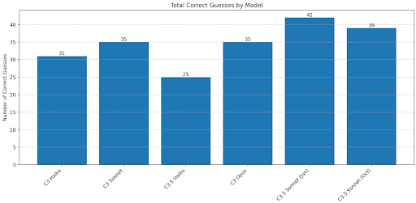
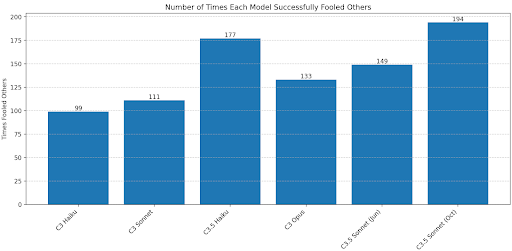
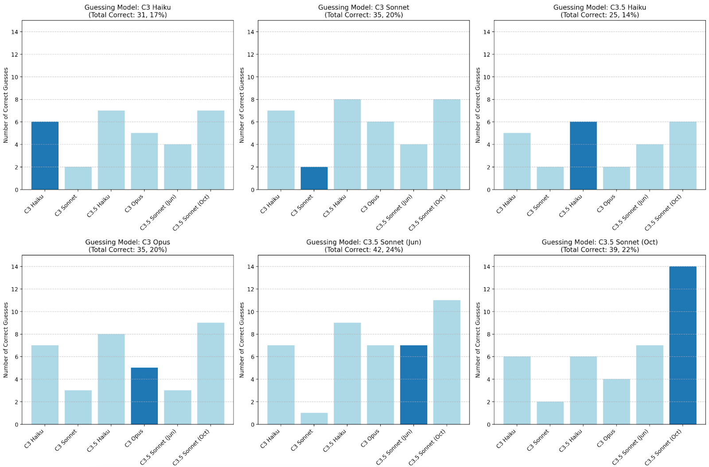
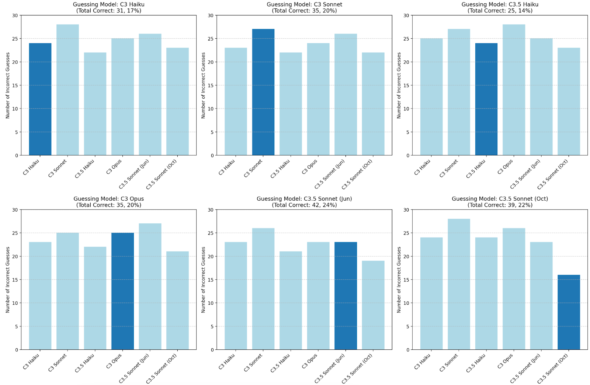

# Star Chameleon Creativity Test

Gwern wrote [a post on creativity benchmarks](https://gwern.net/creative-benchmark), one of which is called “Star Chameleon”.

> **Star Chameleon**: measure the style-mimicking flexibility of LLMs by having each LLM generate outputs, then have each LLM generate the second half of each output; then test each LLM on each possible pairing to see if it can classify the original LLM-author’s actual second half vs all the imitators.
>
> A good mimic should be able to create a plausible continuation which fools a lot of the other LLM-judges. A bad mimic, like ChatGPT, will give itself away quickly.

I implemented Star Chameleon for Claudes 3.0-3.5.

**TLDR:** Sonnet 3.5 New is the best chameleon, followed by Haiku 3.5 and then Sonnet 3.5 Old. The Sonnets 3.5 are also the best at guessing the real completion, which Haiku 3.5 is strangely the *worst* at. Sonnet 3.5 New shows some interesting self-awareness-type properties where it’s quite good at identifying its own completions.

 I’ll quickly sketch the methodology and then get to the results in more detail.

### Methodology

* Create a list of 15 creative writing prompts with varying word counts. E.g. “Write a suspenseful short story in the style of Edgar Allan Poe, but set on a space station orbiting a black hole. Focus on the psychological impact of time dilation. Approximately 600 words.”
  * There are more effective ways to elicit creativity but I just went with this because it was easy to implement.
* Have each model respond to each prompt and write a story  
* For each story:  
  * For each model that didn’t write the story:  
    * Take the first half of the story and have the model write the second half  
* For each story:  
  * For each model:  
    * Show the model the first half of the story, and all the second halves  
      * (randomized order)  
    * Make it guess which second half is real

### Metrics

* Times Fooled Others – how often other models guessed your completion as real when it wasn’t  
  * “Chameleon-ness” – ability to imitate others’ style  
* Correct Guesses – how often each model guessed which second half was written by the same model who wrote the first half.  
  * “Perceptiveness”

### Results \- Main

**Times Fooled Others/Star Chameleon**

The newer models did the best. Haiku 3.5’s strong showing surprised me.

**Correct Guesses/Perceptiveness**  
 
The 3.5 Sonnets did the best, followed by Opus and 3.0 Sonnet. Haiku 3.5 had surprisingly *weak* performance here.

You might ask – are models unusually good at recognizing their own completions? Here’s a plot of how many times each model correctly recognized its own completions.

Notably, Sonnet 3.5 New and Haiku 3.5, the same ones that performed well overall, performed *particularly* well at guessing their own completions, especially Sonnet 3.5 New. The same trend isn’t really visible for the other models.

Here’s the same plot for incorrect guesses:

Again here, Sonnet 3.5 New stands out for being unusually unlikely to wrongly identify its own completions as real. So it seems like it has the most “self-awareness” of its own style.

### Code/Data

The code is [here](src/starchameleon.py). (You might need to set the number of concurrent connections to 1 to reproduce.) The full list of completions and guesses is [here](data/star_chameleon_results.json). The analysis notebook is [here](src/chameleon_analysis.ipynb).
